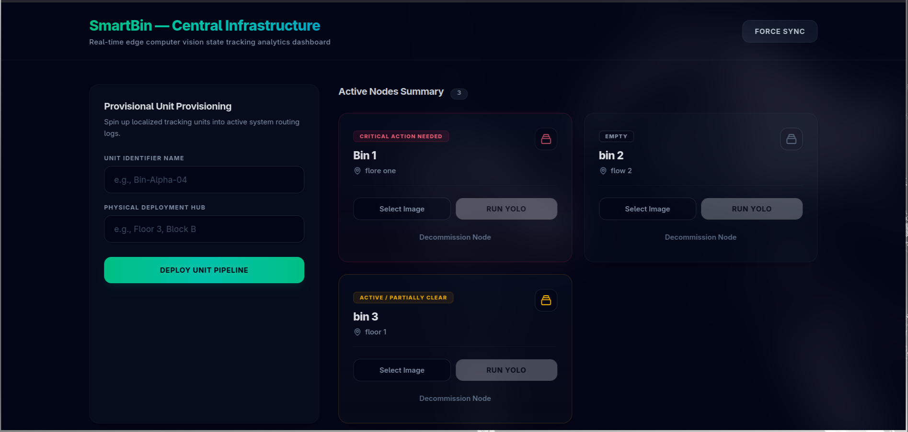
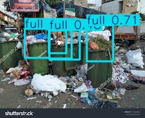

# SmartBin — AI-powered Bin Detection and Dashboard

SmartBin is a full-stack project that demonstrates object detection for waste bins using a YOLO-based model, a FastAPI backend, and a React + Vite frontend dashboard. The app allows creating, managing, and monitoring smart bins with AI-powered fullness detection.

## 🎯 Features

- ✅ Create and manage bins (name, location)
- ✅ Upload images for real-time bin detection
- ✅ Automatic bin status updates based on AI detection
- ✅ List bins with sorting by priority (full bins first)
- ✅ Delete bins and manage inventory
- ✅ Intuitive React dashboard with real-time updates
- ✅ REST API for programmatic access

## 📊 Frontend Dashboard Preview



The dashboard provides an intuitive interface for bin management with:
- Real-time bin status monitoring
- One-click image upload and detection
- Priority-based sorting
- Quick actions (create, refresh, delete)

## 🔍 Model Detection Examples

### Sample Input


### AI Detection Output
The model performs real-time detection to identify and classify bins:



## 📁 Repository Layout

```
smartbin-ai/
├── backend/                      # FastAPI application
│   ├── app/
│   │   ├── main.py              # Application entry and CORS setup
│   │   ├── api/v1/              # API routers
│   │   │   ├── model.py         # Prediction endpoints
│   │   │   └── bins.py          # Bin management endpoints
│   │   ├── service/             # Business logic
│   │   │   ├── detector.py      # YOLO detector service
│   │   │   └── bin_service.py   # Bin operations
│   │   ├── repository/          # Database CRUD operations
│   │   ├── model/               # SQLAlchemy ORM models
│   │   └── schema/              # Pydantic request/response schemas
│   └── requirements.txt
├── frontend/                     # React + Vite dashboard
│   ├── src/
│   │   ├── App.tsx              # Main dashboard UI
│   │   ├── App.css              # Dashboard styles
│   │   └── main.tsx
│   └── package.json
├── models/                       # Trained model weights
│   ├── best.pt                  # Best checkpoint (used in production)
│   ├── last.pt                  # Last checkpoint
│   └── runs/                    # Training artifacts and predictions
├── data/                         # Training dataset
│   └── (images and labels for model training)
├── image/                        # Demo and visual assets
│   ├── visual.png               # Dashboard mockup
│   ├── sample.jpg               # Sample test image
│   └── sample_detection.jpg     # Detection result example
└── README.md
```

## 🤖 Model Architecture & Performance

SmartBin uses **YOLOv8s** (Small), a lightweight yet accurate object detection model optimized for edge deployment.

### Model Training Summary

**Training Configuration:**
- Model: YOLOv8s (Small)
- Total Epochs: 47 (Early stopping at epoch 27)
- Training Time: 0.198 hours (~12 minutes)
- Model Size: 22.5 MB (optimized, 73 layers)
- Parameters: 11,126,358
- Computational Complexity: 28.4 GFLOPs

### 📈 Model Evaluation Results

#### Final Validation Metrics (Best Model - best.pt)

| Metric | All Classes | Bin Class | Full Class |
|--------|------------|-----------|------------|
| **Precision (P)** | 0.787 | 0.832 | 0.742 |
| **Recall (R)** | 0.735 | 0.852 | 0.619 |
| **mAP@50** | 0.77 | 0.888 | 0.653 |
| **mAP@50-95** | 0.427 | 0.576 | 0.279 |

**Dataset Statistics:**
- Total Images: 401
- Total Instances: 780
- Bin instances: 696 (89.2%)
- Full instances: 84 (10.8%)

### ⚡ Inference Performance

```
Speed Breakdown (per image):
├── Preprocessing:    0.1ms
├── Inference:        3.3ms
├── Loss Calculation: 0.0ms
└── Postprocessing:   3.2ms
────────────────────────────
Total:              ~6.6ms per image (≈151 FPS)
```

### 🎯 Model Capabilities

**Detected Classes:**
1. **bin** - Standard bin (not full)
   - Confidence Threshold: 0.5+
   - mAP@50: 0.888 (Excellent)
   
2. **full** - Full/overflowing bin
   - Confidence Threshold: 0.5+
   - mAP@50: 0.653 (Good)

**Key Metrics Explanation:**
- **Precision**: How many predicted bins are actually correct (83.2% for regular bins)
- **Recall**: How many actual bins are correctly detected (85.2% for regular bins)
- **mAP@50**: Average precision at 50% IoU threshold - Overall quality at standard threshold
- **mAP@50-95**: Average precision across IoU thresholds (0.5 to 0.95) - Strictest evaluation

## 🔌 API Documentation

Base URL: `/api/v1`

### Endpoints

#### Predictions
```bash
POST /api/v1/model/predict
```
Upload an image and get real-time detections.

**Request:**
```bash
curl -X POST http://127.0.0.1:8000/api/v1/model/predict \
  -F "file=@/path/to/image.jpg"
```

**Response:**
```json
{
  "detections": [
    {
      "class_id": 0,
      "class_name": "bin",
      "confidence": 0.95,
      "bbox": [10, 20, 100, 150]
    }
  ],
  "processing_time_ms": 6.6
}
```

#### Bin Management

**Create a bin:**
```bash
POST /api/v1/bins
-H 'Content-Type: application/json'
-d '{"name":"Lobby Bin","location":"Main Entrance"}'
```

**List bins:**
```bash
GET /api/v1/bins?sort=priority
```

**Get full bins only:**
```bash
GET /api/v1/bins/priority
```

**Upload photo for detection:**
```bash
POST /api/v1/bins/:bin_id/photo
-F "file=@/path/to/photo.jpg"
```

**Delete a bin:**
```bash
DELETE /api/v1/bins/:bin_id
```

## 🚀 Running Locally

### Backend Setup (Python 3.10+)

```bash
cd backend

# Create virtual environment
python -m venv .venv
source .venv/bin/activate  # On Windows: .venv\Scripts\activate

# Install dependencies
pip install -r requirements.txt

# Start server
uvicorn app.main:app --reload --port 8000
```

Backend runs at: `http://127.0.0.1:8000`

### Frontend Setup (Node.js 18+)

```bash
cd frontend

# Install dependencies
npm install

# Start development server
npm run dev
```

Frontend runs at: `http://localhost:5173`

### Access the Application

1. Open http://localhost:5173 in your browser
2. Create bins and upload images for detection
3. Monitor detection confidence and bin status

## 📋 Technical Stack

| Component | Technology | Version |
|-----------|-----------|---------|
| **Frontend** | React + TypeScript | Latest |
| **Frontend Build** | Vite | 5.x |
| **Backend** | FastAPI | Latest |
| **ML Model** | YOLOv8s (Ultralytics) | Latest |
| **Database** | SQLAlchemy | Latest |
| **Server** | Uvicorn | Latest |

## ⚙️ Configuration Notes

- **GPU Support**: The model is loaded in CPU mode by default. For faster inference, configure CUDA in `app/service/detector.py`
- **Model Confidence Threshold**: Default 0.5 (adjustable in detector service)
- **Max File Upload Size**: Configure in FastAPI settings
- **CORS**: Enabled for localhost development (restrict for production)

## 🔒 Production Considerations

- [ ] Add authentication for bin management operations
- [ ] Implement rate-limiting for detection endpoints
- [ ] Set up structured logging and monitoring
- [ ] Configure GPU acceleration if available
- [ ] Add image storage with cleanup policies
- [ ] Implement database backups
- [ ] Add API request validation and sanitization
- [ ] Set up HTTPS and secure headers

## 🧪 Testing

Currently building test suite. To run tests:

```bash
cd backend
pytest tests/
```

## 📚 Additional Resources

- [YOLO Documentation](https://docs.ultralytics.com/)
- [FastAPI Guide](https://fastapi.tiangolo.com/)
- [React Documentation](https://react.dev/)

## 🤝 Contributing

Contributions welcome! Please:
1. Fork the repository
2. Create a feature branch
3. Submit a pull request

## 📝 License

MIT License - feel free to use this project for learning and development.

---

**SmartBin** — Intelligent waste management through AI-powered detection. Happy coding! 🚀
